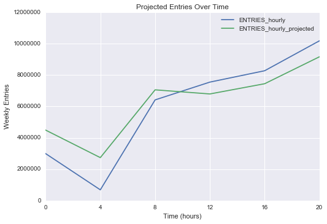
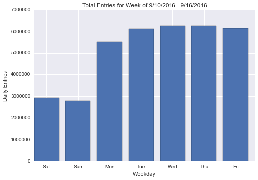

# Dynamic Pricing Model for NYC's MTA system

## Goal  
The goals of this project were:  
* Data cleaning  
* Data analytics  
* Pandas/NumPy  
* Python expertise  

## Overview  
Analyze MTA subway data for NYC, which is publicly available [here](http://web.mta.info/developers/turnstile.html). I 
collaborated with 3 other people for this project ([Kevin Du](https://https://github.com/k-du),[Joshua Concepcion](https://github.com/airjoshua),
[Daniel Vigil](https://github.com/dmvpro)). We extracted one week's worth of data
 from the MTA website and analyzed the total number of entries over a 24-hour time period. 

Our group proposed a dynamic pricing model that would implement a fare reduction during off-peak hours in order to:
1. Decrease congestion during peak hours  
2. Increase ridership  

## Data Cleaning and Analytics

The data was tricky to interpret because the hours were not uniformly binned across all days. For example, some of the
entries were recorded over three-hour periods and some were over four-hour periods. Due to the limitations of the available data, 
 we decided to arbitrarily rebin the entries into four-hour time periods. After doing so we found that the "off peak" hours 
 were from 8pm to 8am.  
 
Using this knowledge, we created the following graphs:  

## Analysis  

The first graph above is a line graph of the current entries over a 24-hour period 
(blue) and a projection of estimated entries over the same period if a price shift were to be implemented. 
The projected data was designated after conducting research on elasticity and dynamic pricing models in other industries.
We made these projections based off of that research and the assumption that there would be less fluctuation in ridership during 
peak hours due to work or school commuters who may not have flexibility in their travel time.  

## Discussion  

Further research on subway pricing indicated that an increase or decrease in the price during 
certain hours can influence rider's behavior to a certain extent. As such, a decrease in fares during off 
peak hours should theoretically redistribute some of the rider's from peak to off peak hours, and thus alleviate congestion. 
The lower fare may also encourage more individuals to take the subway over alternate transportation options, 
thus leading to an increase in overall number of riders.

## Conclusion  

There is much more analysis and research to be done, however given the limited time we had to complete the project 
I believe we came up with a decent proposal! You can find our presentation [here](Chalenge1_Benson_Tm4.pdf), or in the repo above.
