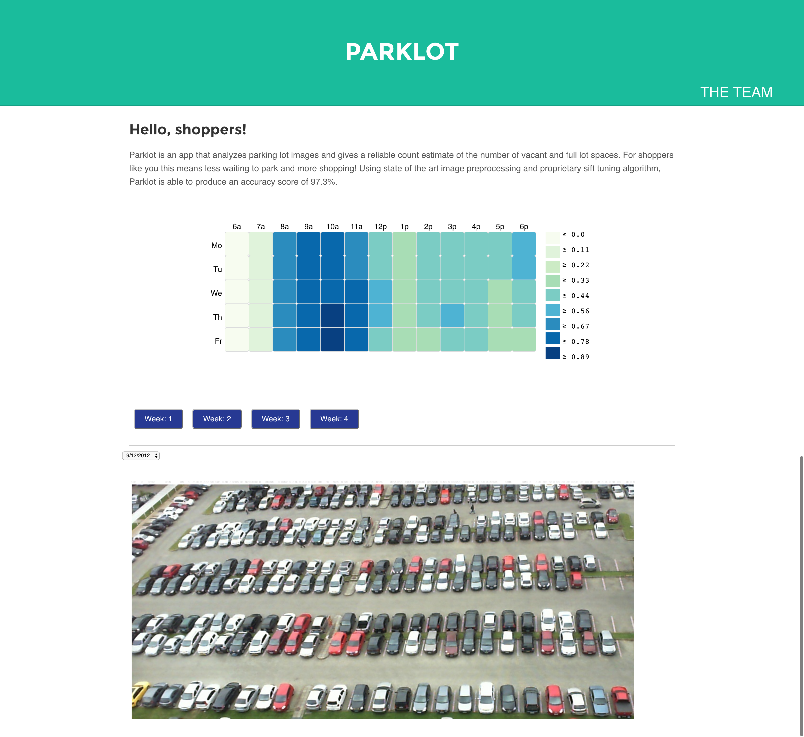

# Is That Spot Open?  	

### Goal   
The goals of this project were:       
* Classification models using scikit-learn    
* Visualization with D3.js    
* Flask webapp
* Collaboration with other data scientists  

### Overview
For this project I collaborated with Rohan Shah, D.H. Kim, and Chris Buie. The goal of this project
was to classify whether or not a spot in a parking lot was taken or not. We then created a Flask
webapp that would take in an image of a parking lot and, using D3.js, tag spots that were
open and not open.

### Data Cleaning and Analytics
We found an open dataset of over 12,000 images taken from a security camera for a 
business parking lot. The images were all from the same angle and of the same parking lot, however 
the images were taken at multiple times over every hour of the day and through different weather
conditions.

There were several obstacles we faced during the classification process. First, we needed 
to create an algorithm that would accurately identify parking spots in a lot. After several
tries we were unable to accurately pick out the white lines of the parking lot image. We therefore decided
to manually assign the centroid points to every spot in one image, and used those coordinates for our analysis of
all subsequent images. Since all of the images were taken in the same position, it was easy to apply
 those centroid coordinates to the other images.  

Next, we ran SIFT (Scale Invariant Feature Transform) to populate the image with "density points". These SIFT points
populated areas of the image that were dense in color. We adjusted the radius and edge identification parameters of 
the SIFT analysis so that it would place points on the vehicles, if there was one. Since the images were taken 
during various weather conditions, the image saturation was not consistent and therefore the successful placement 
of SIFT points varied across weather conditions. Therefore we decided to first test our algorithm on one 
weather condition, which in this case was "cloudy".  

Once we placed the SIFT points we ran both KD-Tree and Ball Tree to count the SIFT point density around 
the centroids. We classified the spot as "full" if there were 4 or more SIFT points. The following scores 
show how our model performed:    

Accuracy Score: 95.3%    
Recall Score: 93.4%    
Precision Score: 72.2%    

The final step was to create a Flask webapp and D3 visualization. We created two visualizations for our final app,
 as seen in the below screenshot of our web Flask app. The first visual is a heatmap that depicts how the parking lot 
 capacity varied over 6am to 6pm from Monday through Friday. The second visual shows one of the images from our 
 dataset and, with a click of a button, is populated with red or green dots to indicate how our algorithm classified 
 spots as full or not full, respectively.  

### Conclusion  

Overall I think we did a great job given our limited expertise at the time with image processing. Our model worked
fairly well, as indicated by the scores above. In addition to the data science aspect, another valuable lesson from 
this experience was learning how to collaborate with other people, especially when overcoming obstacles. 

For the future we will need to do some more tinkering with color scales and object identification so that we can
 extract the parking spot centroids without any manual intervention. This would allow us to extrapolate our 
 algorithms to different parking lots. There is also a significant business case for this application, and with 
 enough resources and time we could apply this algorithm to parking garages in a city and connect it with a 
 mobile app that would report parking availability in real-time. For those of us living in crowded cities, 
 that knowledge is very valuable!  
 
 Please refer to the code and presentation in this folder for more details!

